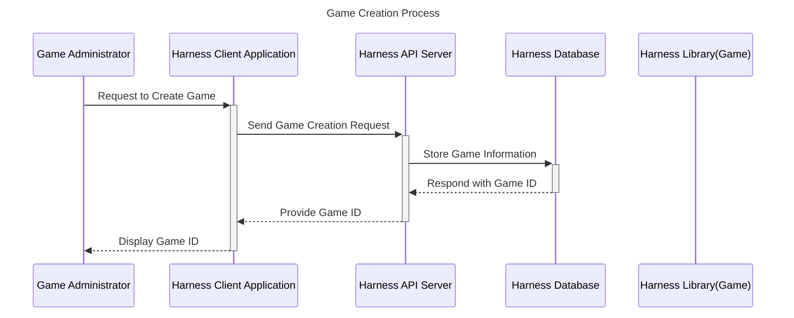

```mermaid
sequenceDiagram
    title  Game Creation Process
    
    participant admin as Game Administrator
    participant client as Harness Client Application
    participant api as Harness API Server
    participant db as Harness Database
    participant lib as Harness Library(Game) 

    admin->>+client: Request to Create Game
    client->>+api: Send Game Creation Request
    api->>+db: Store Game Information
    db-->>-api: Respond with Game ID
    api-->>-client: Provide Game ID
    client-->>-admin: Display Game ID
```