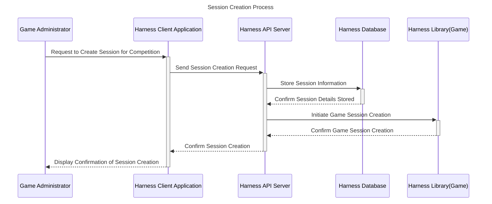

```mermaid
sequenceDiagram
    title  Session Creation Process
    
    participant admin as Game Administrator
    participant client as Harness Client Application
    participant api as Harness API Server
    participant db as Harness Database
    participant lib as Harness Library(Game) 

    admin->>+client: Request to Create Session for Competition
    client->>+api: Send Session Creation Request
    api->>+db: Store Session Information
    db-->>-api: Confirm Session Details Stored
    api->>+lib: Initiate Game Session Creation
    lib-->>-api: Confirm Game Session Creation
    api-->>-client: Confirm Session Creation
    client-->>-admin: Display Confirmation of Session Creation
```